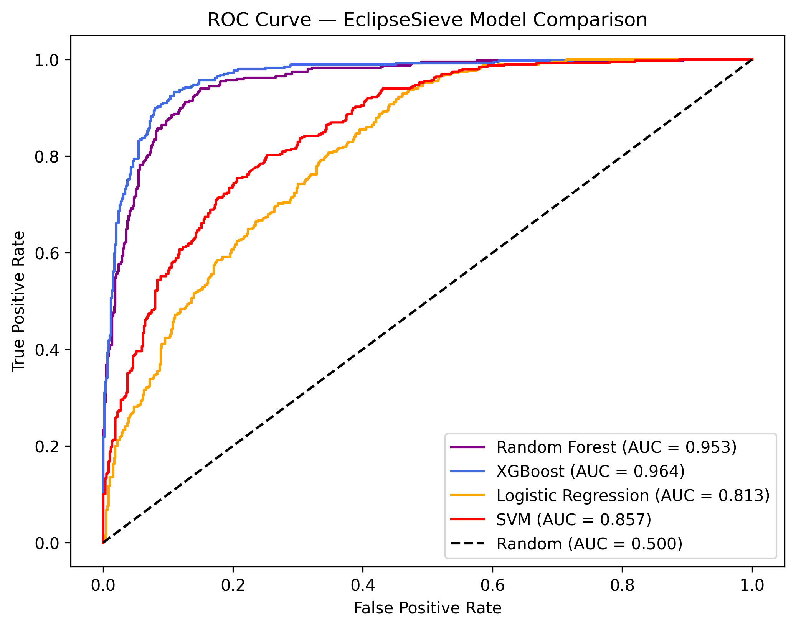
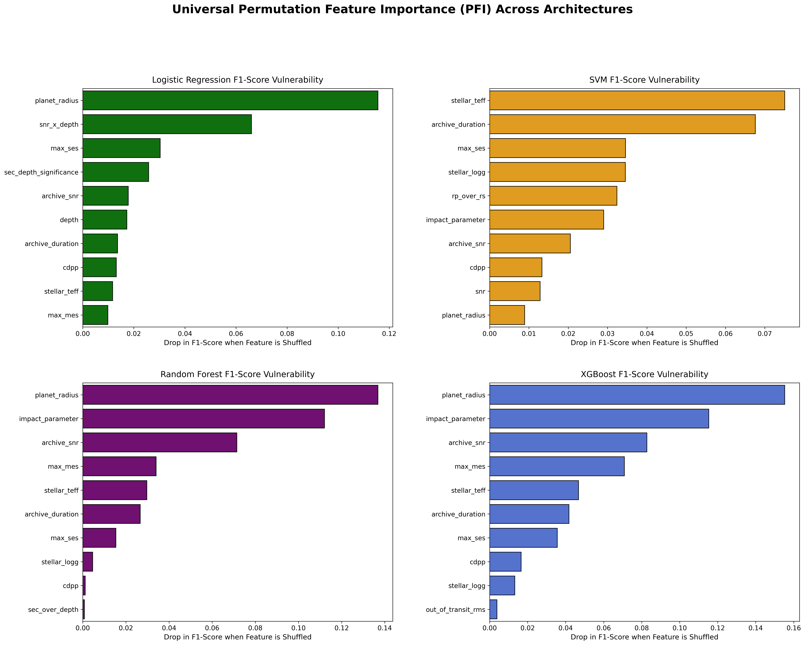
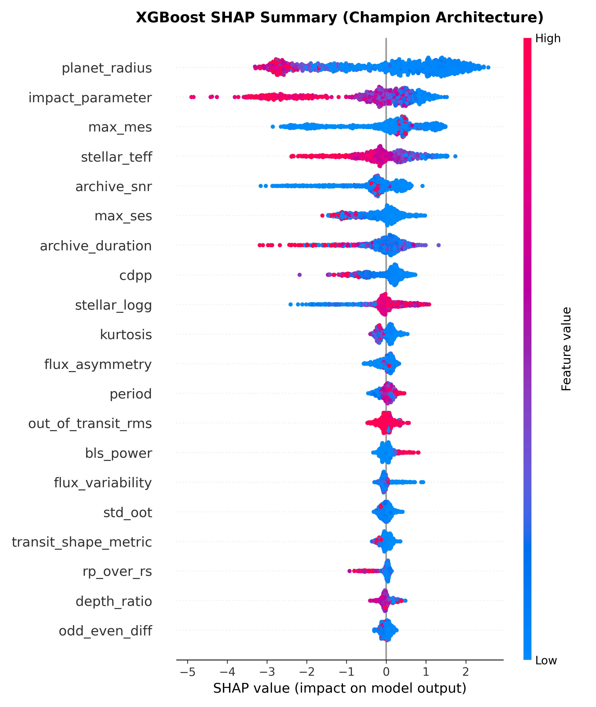
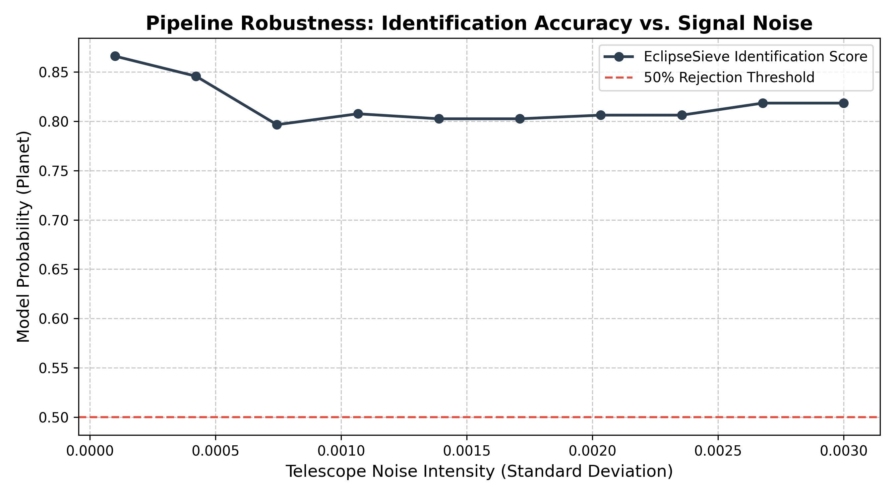
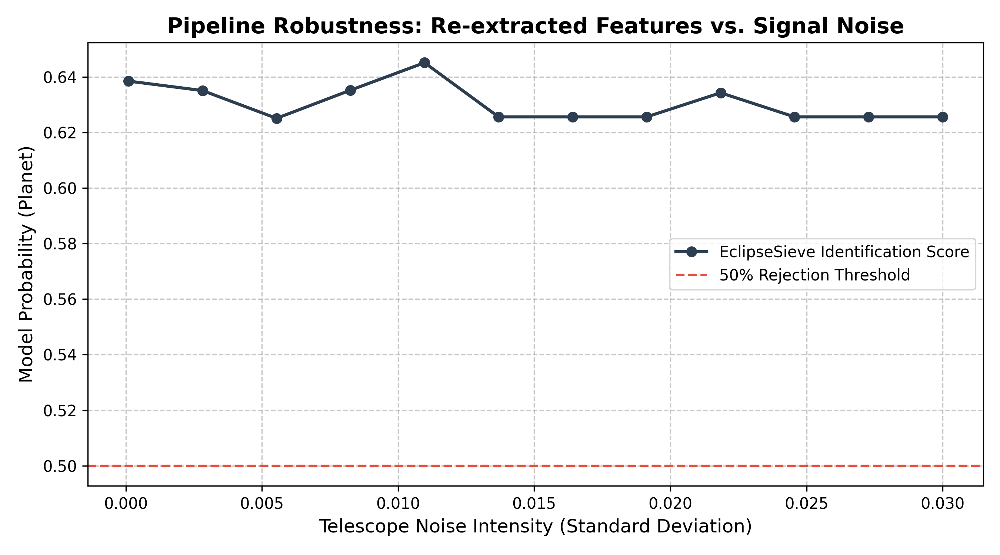
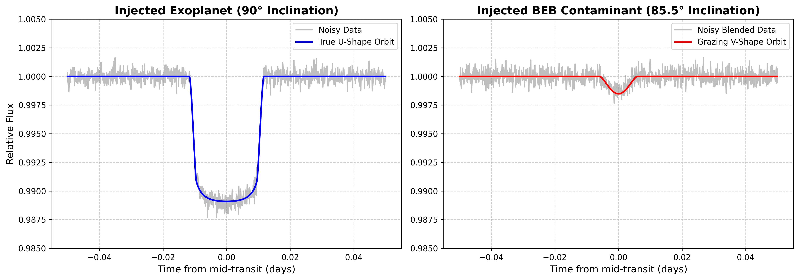
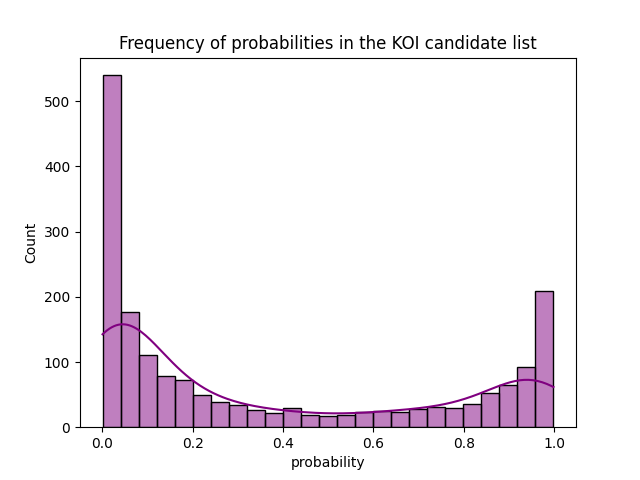

    

An exoplanet vetting pipeline that analyzes catalog dependency and the low-signal regime where automated vetting reaches its limits.

    
    
    

> *TL;DR* - ​EclipseSieve is an XGBoost pipeline that vets transit signals from NASA’s Kepler Object of Interest database. The model separates actual exoplanets from false positives, such as eclipsing binaries. EclipseSieve achieves a nested-CV accuracy of 90.9%, an F1 score of 0.890, and an ROC-AUC score of 0.966. This project focused on finding where the performance comes from by using five independent tests that eventually revealed that the model heavily leans on NASA catalog features, while the bespoke features contribute little to the model’s decision. The project also analyzes the barrier where automating vetting reaches its ability to function by defining an “ambiguity barrier.” All in all, this project is an audit of exoplanet machine learning classification that examines the limits and dependencies of vetting architectures.

## Table of Contents
- [Problem](#problem)
- [Approach](#approach)
- [Data & Feature Extraction](#data--feature-extraction)
- [Model Selection](#model-selection)
- [Feature Importance](#feature-importance)
- [Cross-Validation](#cross-validation)
- [Ambiguity Barrier](#ambiguity-barrier)
- [Confident Wrong Cases](#confident-wrong-cases)
- [Robustness](#robustness)
- [Cascade Investigation](#cascade-investigation)
- [Candidate Application](#candidate-application)
- [Limitations](#limitations)
- [Conclusion](#conclusion)

## Problem
Exoplanets are planets outside our solar system. Because many of them are so far away, we need to use certain methods to detect them, one of which is the transit method. The transit method examines dips in a star's light curve. A dip in brightness suggests that something dimmed the star; many times this is an exoplanet, but sometimes something else is affecting the star.

One type of these culprits is known as an eclipsing binary. An eclipsing binary is a binary star system in which one star passes in front of the other, causing a change in brightness. A specifically problematic type of eclipsing binary is known as a background eclipsing binary (BEB). These are binary systems located behind the target star, but still within our line of sight. As a result, the telescope is unable to distinguish the target star from the fainter binary systems and records their combined light. Since the binary system is much farther away and its light is blended with the brighter star's, its eclipse appears as a shallow dip, resembling a planet's.

Background eclipsing binary systems are among the most common and difficult false positives to identify, making it crucial to thoroughly inspect them to ensure the accuracy and reliability of any exoplanet vetting machine-learning pipeline. However, even effective vetting faces an ambiguity barrier, or a subset of cases that resist confident classification. Understanding the core of that barrier is a problem worth investigating in its own right.

## Approach
EclipseSieve is a single gradient-boosted (XGBoost) classifier trained on 32 features: 17 raw photometric features (extracted from light curves via BLS), 8 NASA archive features, and 7 engineered features. The model returns the probability that a candidate is an exoplanet. On the held-out data, it achieves mean scores of 90.9% accuracy, an F1 score of 0.890, and a ROC-AUC score of 0.966 after using 5-fold nested cross-validation. I also tested two separate cascade architectures; however, neither provided a performance benefit. The cascade investigation is further described in the Cascade Investigation section.

## Data & Feature Extraction
EclipseSieve employs a comprehensive set of 32 features, which include 17 raw photometric features derived from the light curve, 8 features sourced from the NASA archive, and 7 engineered features designed specifically to identify false positives, including several aimed at eclipsing binaries. Data have been recorded for a group of 4,927 false positives and confirmed exoplanets, with a split of 60% false positives and 40% exoplanets. 

The majority of these features are photometric, extracted from the light curve using the Box Least Squares (BLS) algorithm. This algorithm generates a periodogram that simplifies transit data, allowing for the derivation of critical metrics such as transit depth (the change in flux during the transit), duration (the time the transit lasts), symmetry, and BLS power (indicating the significance of the strongest transit). The BLS duration is drawn from a default duration grid rather than being freely fit, so it is effectively composed of a few discrete values, a limitation explained later. Collectively, these metrics provide valuable insights into the geometry of the light curve. 

The features from the NASA archive are sourced directly from the data collected during the NASA Kepler mission. This set includes essential parameters such as planet radius, impact parameter (which measures the proximity of the transit to the center of the host star), archive signal-to-noise ratio (SNR) and duration. These parameters are compared against the SNR and duration derived from the light curve to enhance analysis. 

Furthermore, the model incorporates engineered features, which are derived by manipulating two or more distinct quantities. These features are particularly useful for uncovering signatures of false positives, with a focus on those arising from eclipsing binaries. An example of an engineered feature is the ratio of duration to period, which serves as a metric for assessing the fraction of the orbit spent in transit. By making physical patterns explicit, engineered features give the model relationships it would otherwise have to infer by itself. This compilation of features provides the model with a wide range of options for vetting candidates. The differentiation between catalog-sourced features and those derived from the light curve is crucial for the subsequent analysis of feature importance. Column definitions, datasets, and known limitations are documented in [`DATA_INFORMATION.md`](DATA_INFORMATION.md).

## Model Selection
I initially evaluated four model families: a linear baseline using Logistic Regression, a margin-based method through Support Vector Machines, and two tree ensemble techniques, Random Forest and XGBoost. Each model was evaluated on the same data under identical cross-validation to determine which could best handle the multivariate light-curve and catalog data. Ultimately, XGBoost won on every metric, achieving 90.9% accuracy, an F1 score of 0.890, and a ROC-AUC of 0.966, with Random Forest close behind at 88.7% accuracy, 0.861 F1, and 0.953 ROC-AUC. The linear and margin models clearly fell behind, with the SVM at 73.6% accuracy, 0.725 F1, and 0.841 ROC-AUC, and Logistic Regression at 70.1% accuracy, 0.699 F1, and 0.801 ROC-AUC. 

This suggests the decision boundary is nonlinear, with the linear models unable to capture the feature interactions the tree ensembles split on natively. XGBoost's slight advantage over Random Forest led me to select it as the final model, though the margin between the two tree ensembles was small. All metrics were assessed through 5-fold nested cross-validation, elaborated upon in the Cross-Validation section. Notably, this performance relies on the full 32-feature set; how much of it depends on catalog versus extracted features is examined in the Feature Importance section. 

| Model | Accuracy | F1-Score | ROC-AUC |
|-------|----------|----------|---------|
| XGBoost | 90.9% | 0.890 | 0.966 |
| Random Forest | 88.7% | 0.861 | 0.953 |
| Support Vector Machine (SVM) | 73.6% | 0.725 | 0.841 |
| Logistic Regression | 70.1% | 0.699 | 0.801 |

*ROC curves are from a single held-out split; headline metrics are nested cross-validation means (see Cross-Validation).*

## Feature Importance
After assessing the model's performance, it became essential to uncover the key features that contributed to its operations, thus moving away from the "black box" characterization. This investigation utilized Permutation Feature Importance (PFI), ablation testing, and Shapley Additive exPlanations (SHAP). PFI operates by shuffling the values of a feature across samples and measuring the resultant drop in performance. When applied to EclipseSieve, it was evident that the model primarily relied on catalog features, such as planet radius, impact parameter, archive SNR, and maximum MES. Notably, planet radius emerged as the most significant feature, resulting in a substantial decrease of 0.155 in the F1 score. Conversely, many engineered features designed for eclipsing binaries displayed minimal influence on the F1 score.

The importance of catalog features was further validated during the ablation testing phase, where their complete exclusion led to a model accuracy of 68.6%, an F1 score of 0.671, and a ROC-AUC of 0.778. This represents a 22-point accuracy deficit compared to the model that incorporated catalog features, thereby reinforcing the conclusions drawn from the PFI analysis. These findings suggest a pronounced reliance on features sourced from the NASA archive rather than those extracted from the light curve. 

*Permutation feature importance across all four models; catalog features top every ranking*

To enhance the testing process and address PFI's tendency to underestimate correlated features, I conducted a second ablation by removing feature groups instead of individual columns. In this follow-up analysis, features were categorized into four suites based on their characteristics: Stellar Context, Transit Geometry, Noise and Signal, and Eclipsing Binaries & Interference. The group ablation test revealed that omitting the Stellar Context suite resulted in a 3.8% drop in accuracy; excluding Eclipsing Binaries & Interference led to a 2.8% decline; removing Transit Geometry caused a 0.8% decrease, and most notably, eliminating Noise and Signal resulted in a 7.1% accuracy drop. 

The outcomes of the group ablation test indicate that the engineered features related to eclipsing binaries are not inert; rather, they carry a small, redundant signal that no single feature monopolizes, as their ablation results, while smaller, were comparable to those of the Stellar Context suite, which predominantly comprises catalog features (including planet radius, stellar effective temperature, and surface gravity). However, it should be noted that the Stellar Context suite consists of only 4 features, compared with 8 in the EB & Interference suite. This observation implies that the perceived passivity of the eclipsing binary features, as indicated by the PFI, does not capture the small collective signal they exhibit when used in conjunction. Furthermore, the results emphasize the significance of noise and signal features in the model, which are composed of both catalog and locally sourced elements. Overall, these analyses suggest that while the eclipsing binary features may be individually dispensable, they collectively contribute a slight signal that enhances the model's performance. However, they are easily overshadowed by the catalog and signal strength features, which are the model's primary focus. 

| Ablated Suite | Features Remaining | Accuracy | F1-Score | ROC-AUC | Accuracy Δ |
|---------------|-------------------|----------|----------|---------|------------|
| None (Control Baseline) | 32 | 90.4% | 0.886 | 0.966 | — |
| Dropped Noise and Signal | 21 | 83.3% | 0.798 | 0.914 | −7.1% |
| Dropped Stellar Context | 28 | 86.6% | 0.842 | 0.939 | −3.8% |
| Dropped Eclipsing Binaries & Interference | 24 | 87.5% | 0.852 | 0.947 | −2.8% |
| Dropped Transit Geometry | 23 | 89.6% | 0.875 | 0.961 | −0.8% |

*Group ablation results from a single held-out split; the baseline reads 90.4% rather than the nested-CV headline of 90.9% (see Cross-Validation).*

As a final verification of feature importance, SHAP testing was applied to EclipseSieve. This approach differs from PFI in that it attributes each prediction to its features and illustrates the directional influence of each feature on the outcome. The SHAP results corroborated the earlier findings regarding the significance of catalog features, further demonstrating how the model utilizes high exoplanet radii to identify false positives because targets with radii that are too high push the model to predict a brown dwarf or star, which are the exact false positives the model should flag. The consensus across these three methodological approaches to feature importance emphasizes that EclipseSieve’s predictive power is predominantly derived from catalog-sourced features that reveal patterns of noise and signal, as well as the critical significance of planet radii.

*XGBoost model. Catalog features (planet_radius, impact_parameter, stellar_teff) dominate the top; engineered EB features sit near the bottom.*

## Cross-Validation
To evaluate the model, nested 5-fold cross-validation is used. This process splits the dataset into five sections, with four used for training and one for testing. The process is repeated five times, with accuracy recorded for each test. Nested 5-fold CV differs from simple CV by using two loops: an outer and an inner. The outer loop splits the dataset into five sections, then sets aside the non-testing section for the inner loop. This outer loop process is performed five times. The inner loop uses the training folds from the outer loop and finds the optimal hyperparameters. This new model then goes back to the outer loop and is evaluated there, free of the optimistic bias that comes from tuning on the evaluation data. The model’s final accuracy is the average across all tests. Nested 5-fold CV provides a more accurate representation of the model's effectiveness and is more reliable than a single training and testing split. 

EclipseSieve's 90.9% accuracy, 0.890 F1, and 0.966 ROC-AUC scores were taken with cross-validation. The table in the Model Selection section is pulled from the results of the CV, while the ablation testing table was recorded as single-split results, which is why its baseline (90.4%) differs slightly from the nested-CV headline (90.9%) despite being the same model. Separate experiments also use their own single-split testing methods, with the main test splitting the dataset into 80% training and 20% testing, and the specialist cascade splitting the data into 60% training for stage 1, 20% training for stage 2, and 20% testing. The data split and cross-validation method play a crucial role in the metrics reported.

## Ambiguity Barrier
The ambiguity barrier represents the range of cases in which the model exhibits uncertainty, defined as a confidence level between 30% and 70% regarding the classification of an exoplanet. This barrier signifies that the model cannot fully make a decision toward an exoplanet or a false positive. By characterizing this limit, exoplanet vetting can be improved by flagging ambiguous cases for human review rather than forcing a classification.

Within the dataset of 986 labeled cases (confirmed or false positives) that the model tested on, 9.7% (96 cases) of the data was considered ambiguous by the model. Within the candidates dataset of 1,845 unlabeled cases, 12.6% (233 cases) of the data was deemed ambiguous. Since the candidate dataset is comprised of unresolved objects of interest, it makes sense for them to be harder than adjudicated ones, thus more ambiguous cases.

To rigorously assess whether ambiguous cases differed from confident cases and to identify any features responsible for this distinction, I employed the Mann-Whitney U test. This rank-based test is particularly suited for the heavily skewed feature distributions observed. Furthermore, I applied the Benjamini-Hochberg correction to address the multiple testing of features. The findings revealed that the ambiguity barrier is diffuse, with no single feature distinctly separating ambiguous from confident cases. Any statistically significant differences observed were characterized by small effect sizes. Notably, many signal-strength features exhibited lower median values within the ambiguous group; however, BLS power and maximum MES did not withstand the correction, indicating that these value discrepancies may fall within sampling noise. The features that did separate the groups were SNR, transit SNR, and planet radius, which were all slightly lower in the ambiguous regime. The barrier is therefore not sharp but a faint, distributed dimming of signal strength, with no single feature acting as a clean discriminator between the two groups.

The data confirms the existence of a real but diffuse ambiguity barrier that is defined by a faint weakening of the signal-strength features the model depends on, as well as intersecting with the catalog signal features upon which the model heavily relies. This means that the model’s competence and its uncertainty come from a common source. This is shown most directly with the catalog-free model, which is stripped of many of its decisive features. As a result, most of its predicted probabilities are within the ambiguous band for the majority of all its cases. This systematically collapses the data produced by the catalog-free model into one giant ambiguous regime. Therefore, the ambiguity barrier is not separate from the model’s competence, but what the competence of the model looks like when it runs out.

## Confident Wrong Cases
On the opposite end of the ambiguity spectrum lie instances where the model exhibits a high level of confidence yet arrives at incorrect conclusions. Together, these two scenarios represent the distinct failure modes of contemporary automated vetting processes. Since the evaluation of these cases hinges on whether an exoplanet is classified as confirmed or as a false positive, only labeled cases were utilized, resulting in a dataset comprising 986 instances. 

Confidently incorrect cases are characterized by model confidence levels of 20% or less, or 80% or more regarding an exoplanet's classification. This criterion effectively delineates a gap between ambiguous cases and those marked by high confidence, while still leaving enough cases to examine. Consequently, 42 such instances were identified.

Out of the 42 identified, 28 were predicted to be an exoplanet but were actually false positives, and 14 were predicted to be a false positive but were actually exoplanets. The 2-to-1 skew toward missing false positives is more consequential to a vetting tool because waving through a contaminant with high confidence defeats the point of the pipeline more than missing an exoplanet. When comparing the missed false positives to the false positives the model correctly caught, the missed group showed lower median values across most features; specifically, decreased BLS power (95 vs 534), transit SNR (3.3 vs 7.3), and a smaller planet radius (2.3 vs 7.7). This suggests that the model’s confident misses concentrate on faint planet-sized false positives, implying contaminants that mimic real transits. Among the 14 real exoplanets the model rejected, a few had atypical geometry, including impact parameters at or above 1.0, a physically inconsistent value (the fitted object would not fully cross the star, yet a transit was recorded), which typically signals a poor fit or a blended source. This signifies that the model distrusted genuine exoplanets whose features appeared to be irregular compared to other cases. However, 42 is a small dataset, so these observations are strictly directional and qualitative, not a statistical rate.

## Robustness
Beyond the standard metrics and experimental methods such as SHAP, PFI, and ablation testing, I conducted two controlled stress tests to identify the features that drive model performance during perturbation. The first test was a noise stress test, which involved injecting Gaussian noise into a synthetic transit, while the second test was a transit injection, where synthetic BEB signals were introduced.

In the noise stress test, Gaussian noise was added to a constructed transit to evaluate how the probability of detecting an exoplanet was affected. Two distinct scenarios were tested: one in which only photometric features were perturbed, leaving the catalog features intact, and another in which all light curve-recoverable features were re-extracted from the noisier data. The photometric-only test reached a plateau of approximately an exoplanet probability of 0.80, exhibiting a nearly flat response. Conversely, the all light-curve recoverable test plateaued at around an exoplanet probability of 0.63 but never dropped below 0.50, even when subjected to noise levels twice the depth of the transit signal. A model strictly built around the transit signal would be degraded to random guessing at such noise levels. This resilience to noise can be attributed to the catalog features, which are inherently immune to noise interference because they are from the NASA archive rather than a light curve. Consequently, the model’s robustness against noise is fundamentally linked to these features, which include planet radius, impact parameter, archive SNR, and other catalog columns. These findings underscore the model's reliance on catalog features.

*Frozen-catalog test: probability stays high because catalog features are untouched by noise.*

*Fully re-extracted test: plateaus around 0.63 but never collapses to random.*

The injection test involved the synthetic generation of BEB signals while varying EB contamination features (such as secondary depth and odd-even differences) across a 25× range (Easy, Medium, Hard), which spans a strong contamination signal (Easy) to a faint one (Hard). The catalog features were maintained at neutral values comparable to those of a potential exoplanet. The results indicated only a slight change in exoplanet probability, ranging from 0.84 (Easy) to 0.86 (Hard). This suggests that despite a 25× change in contamination strength, the probability barely moved, and the model classified all three BEBs as exoplanets. The planet-like catalog features drove the verdict, while the EB contamination features were unable to flag the false positive. Notably, the same BEB signals were correctly rejected when the template carried false-positive catalog values; swapping only the catalog features to planet-like values flipped the verdict to approval, isolating the catalog features as the decisive factor.

*The two injected signals: a deep, U-shaped planetary transit (left) versus a shallow, V-shaped grazing BEB (right).*

This further reinforces the dominance of catalog features, demonstrating that EB features remain largely inert in their presence. Both tests conclusively revealed that the model’s decision-making is predominantly influenced by catalog features rather than engineered transit or EB diagnostics. Collectively, these experiments provide additional confirmation that machine learning exoplanet vetting is heavily reliant on catalog features. While both tests utilized synthetic templates that illustrate the core mechanism, they do not serve as guarantees for population-wide applicability. Furthermore, the injection vector is an artificial construct: planet-like catalog values paired with a binary's transit. So, it probes feature sensitivity rather than realistic BEB detection. The model was deliberately controlled to isolate feature influence, not tricked into failure.

## Cascade Investigation
A cascading pipeline was proposed to enhance the performance of a single model by refining the vetting process for ambiguous cases. This cascading approach operates by channeling test cases through a first-stage XGBoost model, which identifies ambiguous instances. Cases that fall within the 30% to 70% confidence threshold are then deferred to a second stage featuring a specialized model designed specifically to vet false positives.

The initial cascade system combined the original XGBoost model as both stage 1 and stage 2, augmented by three engineered features: transit shape metric, flux variability, and secondary eclipse depth significance. These features were strategically selected to target eclipsing binaries (EBs), with the hypothesis that re-evaluating ambiguous cases alongside the enhanced model would yield improved accuracy. The subsequent cascade system used a depth-5 XGBoost as stage 1 (a differing version from the final depth-7 EclipseSieve model), incorporating the three engineered features while introducing a new model for stage 2. This new model was trained specifically on ambiguous cases to enhance its ability to address difficult instances. Together, both cascades utilized the EB engineered features, but they differ in stage 2. The first cascade only has the EB features in stage 2, while the second specialist cascade uses them in both stages. 

Despite these innovations, neither cascade surpassed the performance of the single model. The cascade that utilized the EclipseSieve model in both stages achieved an accuracy of 90.26%, identical to that of the standalone EclipseSieve pipeline on a held-out set of 986 rows. This cascade identified 96 ambiguous cases, resulting in no improvement in final accuracy, thus demonstrating that the first cascade merely added unnecessary complexity. The second cascade, featuring a specialized stage 2 model, recorded an accuracy of 88.84%, approximately 1.1 points lower than a matched depth-5 single-model baseline (89.96%) trained and tested on the same splits. This comparison is against the depth-5 configuration, not the final depth-7 EclipseSieve. The specialist was trained only on the ambiguous cases identified within a 986-case set, far fewer than the 2,955 used to train stage 1.

The shortcomings of the first cascade stemmed from its reliance on features that were later found to be ineffective. Since these features contributed little signal, stage 2 practically treated the ambiguous cases the same as stage 1. A successful stage 2 would require features that provide new signals for ambiguous cases. The second cascade's limitations were partly attributed to the inert engineered EB features, compounded by the small training dataset available for the specialist model in stage 2. It is plausible that a larger training set could enable the specialist cascade to yield better results, though the inert features would likely persist. Consequently, the single 32-feature XGBoost EclipseSieve model emerged as the most effective and straightforward solution in comparison to the cascade models.

## Candidate Application

After thorough evaluation and testing, the final version of EclipseSieve was applied to 1,845 candidates from the Kepler Objects of Interest (KOI) compilation. The model generated probabilities for each entry in the Kepler Input Catalog (KIC) and assigned tiers of classification (High, Medium, Low, Unlikely) to each candidate. High likelihood is given if the probability is no less than 75%, Medium is no less than 50%, Low is no less than 25%, and Unlikely is anything lower than 25%. Among the 1,845, 26.50% were given High, 8.29% Medium, 8.89% Low, and 56.31% Unlikely.

The true nature of this distribution could be caused by selection effects in the candidate pool, the model's own feature reliance, or both. However, a true answer cannot be determined without labels. Within the group of 1,845 candidates, 12.6% (233) fell within the model's ambiguous range (30% - 70%). This level of ambiguity is anticipated, as the candidates in question are inherently unresolved and generally more challenging to classify compared to the 9.7% ambiguity of the prelabeled dataset. Consequently, approximately one in eight candidates resides in a zone where automated vetting may struggle to provide clarity. Thus, if this tool were to be implemented, around 12.6% of candidates would require deferral for human evaluation. It is important to note that all results generated by EclipseSieve are model predictions on unlabeled data, and without a ground truth, none can be verified as correct. Additionally, by the time this report is published, many of these candidates may have already received a classification.

## Limitations
With all the results that come with this project also come caveats. These limitations range from catalog leakages to sample sizes, but all are disclosed. Furthermore, it should be taken into consideration that this section functions as an honest evaluation, and not a retraction of the result of this project.

The most important caveat concerns planet radius, which acts as the model’s most dominant feature. The radii of exoplanets that have been confirmed are far more accurate due to subsequent observations being performed after the given exoplanet’s discovery. This further refinement of the radii is not applied to unresolved candidates, meaning that the feature partially encodes the object’s status in the catalog rather than functioning as a purely physical feature. Since the model relies on it so heavily, all reported performance figures should be seen as an upper bound. This compounds the model's broader catalog dependence, as removing the archive features results in the model accuracy dropping from 90.9% to 68.6%. Additionally, the engineered eclipsing binary features demonstrated limited value across five independent tests. These central findings indicate that EclipseSieve functions more as a catalog-anchored vetter rather than a light-curve classifier. 

Another limitation relates to the BLS duration, which is obtained directly from the BLS periodogram derived from a light curve. Since the duration is extracted from a default grid of values, it is quantized into a limited set of values that the features derived from it inherit. Nevertheless, this limitation is mitigated as the model circumvents duration and its associated features, focusing instead on the archive duration retrieved from NASA's database. Users who need precise durations should use archive duration instead or re-extract with an explicit duration grid.

It should also be remembered that the candidate results carry no ground truth, as the results of 56.31% of the candidate dataset having less than a 25% chance of being an exoplanet are only model beliefs. On top of that, the tier thresholds are completely arbitrary choices that were chosen by me. 

Many analyses conducted are constrained by sample size. The confident-wrong characterization is based solely on 42 cases and is more directional than statistical. The ambiguity barrier is real but diffuse; each feature separation exhibits a small effect size. The stress tests employed utilize synthetic templates and thus illustrate the mechanism rather than the actual behavior of the tested population. The specialist cascade was evaluated at a depth-5 configuration against a matched baseline, which differs from the final depth-7 model. Significantly, many of these limitations are not strictly by chance but are the project’s central findings as defined by boundaries: the catalog dependencies and feature inertness that this work set out to define.

## Conclusion
Originally, this project was meant to serve as an eclipsing binary vetting pipeline, and rigorous analysis showed that it is heavily driven by catalog features rather than engineered ones. The analyses produced a clear image of the model's internal function and the Kepler dataset. These results show a diffuse relationship between ambiguous and confident cases, and they clarify the fundamentals of catalog importance within EclipseSieve. 

The findings across five different tests show that catalog features carry the performance. These tests were PFI, SHAP, ablation, noise stress, and the injection of synthetic transits. Both PFI and SHAP showed the importance of the catalog features, which tended to be at the top. The ablation testing showed the drop in accuracy once catalog features were removed, which was from 90.9% to 68.6%. In the noise stress test, even when photometric features were overwhelmed by noise, the model maintained a high probability because the catalog features, drawn from the archive rather than the light curve, are untouched by noise. The transit injection test revealed that when all catalog features indicated a planet, while the engineered features suggested an eclipsing binary, the model favored the exoplanet classification, even if the transit was indeed an eclipsing binary. Collectively, these tests provided compelling evidence of EclipseSieve's strong reliance on catalog features.

This project also provided insight into the ambiguity barrier, which acts as a diffuse wall that plays a role in the model's competence. The barrier functions as an area of low signal where the model does not or cannot make a confident decision based on the information it was given. The ambiguity barrier is defined as any transit that falls between a probability of 30% and 70% for an exoplanet, which the model completely collapses into once catalog features are stripped away. In total, the ambiguity barrier functions as a regime characterized by low signal, as well as being a region where the model cannot truly make a decision.

It was also found that confidence errors skew towards missing false positives when analyzing the ratio of the types of cases the model was confident on but ultimately incorrect. Although only 42 were identified, there were twice as many missed false positives as missed exoplanets. This means that the model is labeling false positives as exoplanets, which defeats the point of a pipeline when it waves through false positives that should be ignored by astronomers.

The cascade systems that were tested proved to be inferior to the simple model, as the cascade system, which had additional engineered features in its second stage, resulted in the same accuracy as the single model but with more complexity. The cascade system with a specialist stage 2, which was trained on hard cases, also failed with lower accuracy than the single vetting model. The second cascade may have been impeded by its small specialist training set, but it still underperformed the single model.

The final EclipseSieve model was also applied to 1,845 real candidates and found that ~12.6% were found within the zone of ambiguity. The model also suggests 56.31% of the dataset is unlikely to be an exoplanet, as that percentage has a probability less than 25%. Confirming these results would depend on human review, as the model’s labeling of the candidate set cannot be confirmed by itself.

All these findings can be summed up into one: in the context of Kepler vetting, the simple model based on the catalog summary statistics holds the prediction power, whereas the additional complex components – those manually crafted features of eclipsing binaries, the cascade networks, and the precise light-curve extraction – add little. However, this result is not the intended discovery of this project, but it is still a discovery nonetheless. The verification of whether the hand-crafted features are worth their name is often omitted in the process of designing vetting pipelines, and the proof of the opposite, done in five different ways, is the main achievement of this work.

Several directions are possible based on this. For instance, the BLS durations could be recomputed using a grid-based approach for the purpose of removing the quantization inherent to the approach. More significantly, however, the next step clearly needs to be building a vetter that is catalog-independent by design because it will have no choice but to classify stars from light curve information only, and as discussed prior, this is clearly the case where the issue of catalog dependence arises since the accuracy drops to 68.6%. Lastly, a similar problem of catalog dependence could be investigated for newer missions like TESS. All in all, the project has many paths forward that range from additional complexity to a reach towards new and applicable data.